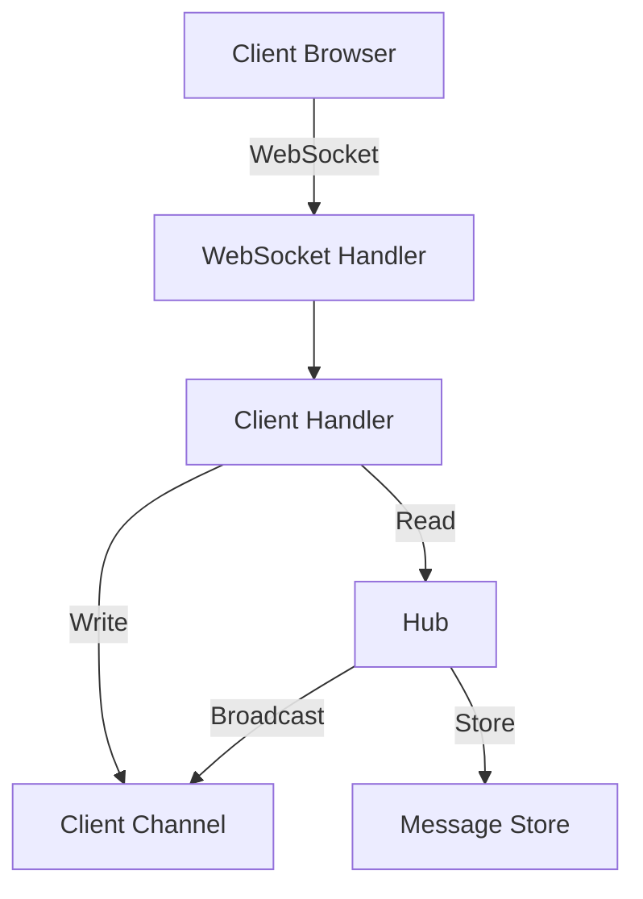
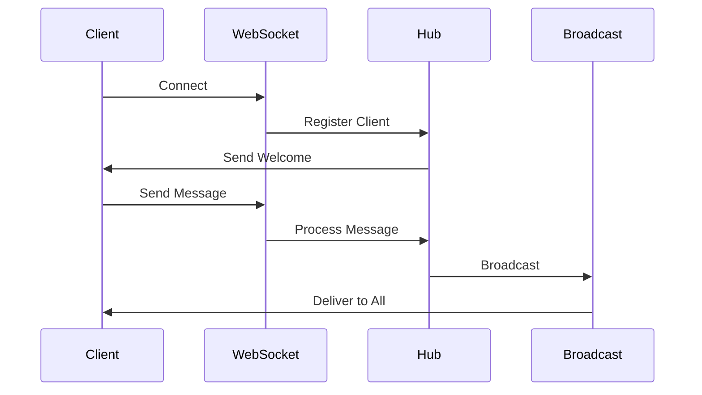
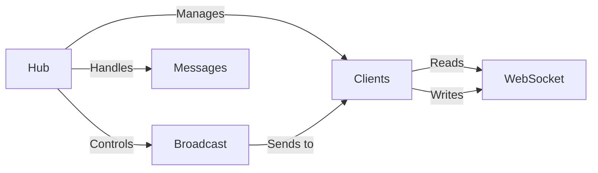

# Mini Chat Server

> A simple WebSocket-based real-time chat application implemented in Golang, perfect for learning Go concurrency and WebSocket communication.

## Table of Contents

- [Features](#features)
- [Architecture](#architecture)
- [Prerequisites](#prerequisites)
- [Project Structure](#project-structure)
- [Core Components](#core-components)
- [Getting Started](#getting-started)
- [Common Issues](#common-issues)
- [Advanced Topics](#advanced-topics)

## Features

### 1. WebSocket Communication

- Built using Gorilla WebSocket package
- Real-time bidirectional communication
- Persistent connection management
- Automatic reconnection handling

### 2. User Management

- Real-time user tracking
- Online status updates
- Unique user identification
- Join/Leave notifications

### 3. Chat Features

- Instant message broadcasting
- Message types support:
  - Text messages
  - System notifications
  - Status updates
- Message history
- Typing indicators

### 4. Concurrency Management

- Go routines for parallel processing
- Channel-based message queue
- Thread-safe operations
- Efficient resource utilization

## Architecture

### High-Level Overview



### Message Flow



### Component Interaction



## Prerequisites

1. **Go Installation**
   - Go version 1.16 or higher
   - GOPATH properly configured
   - Go modules enabled

2. **Dependencies**

   ```bash
   go get github.com/gorilla/websocket
   ```

3. **Development Tools**
   - Any text editor or IDE
   - Terminal access
   - Web browser for testing

## Project Structure

```
mini-chat-server/
├── main.go           # Entry point
├── hub.go           # Central message manager
├── client.go        # Client connection handler
├── message.go       # Message type definitions
└── static/
    └── index.html   # Web client interface
```

## Core Components

### Message Structure

```go
type Message struct {
    Type      string    `json:"type"`     // "chat", "system", "status"
    Content   string    `json:"content"`  // Message content
    Sender    string    `json:"sender"`   // Username
    Timestamp time.Time `json:"timestamp"`// Message timestamp
}
```

### Client Structure

```go
type Client struct {
    hub      *Hub
    conn     *websocket.Conn
    send     chan Message
    username string
}
```

### Hub Structure

```go
type Hub struct {
    clients    map[*Client]bool
    broadcast  chan Message
    register   chan *Client
    unregister chan *Client
    messages   []Message
}
```

## Getting Started

1. **Clone and Setup**

   ```bash
   git clone <repository-url>
   cd mini-chat-server
   go mod init mini-chat-server
   go mod tidy
   ```

2. **Run the Server**

   ```bash
   go run .
   ```

3. **Access the Chat**
   - Open browser: <http://localhost:8080>
   - Enter username and start chatting

## Common Issues

### 1. Connection Problems

- **Issue**: WebSocket connection fails

  ```
  Error: WebSocket connection failed
  ```

  **Solution**: Check if server is running and port 8080 is available

### 2. Message Not Sending

- **Issue**: Messages not appearing
  **Solution**: Check browser console for errors and server logs

### 3. Multiple Connections

- **Issue**: Duplicate messages
  **Solution**: Ensure proper connection cleanup on page reload

## Advanced Topics

### 1. Scaling Considerations

- Message queue implementation
- Multiple server instances
- Load balancing

### 2. Security Improvements

- User authentication
- Message encryption
- Rate limiting

### 3. Feature Extensions

- Private messaging
- File sharing
- Room management
- Message persistence

## Contributing

Feel free to submit issues and enhancement requests!
